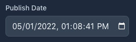
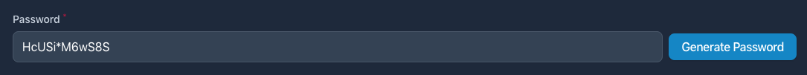

# A collection of components to extend Filament Admin.

[](https://packagist.org/packages/awcodes/filament-extras)
[](https://packagist.org/packages/awcodes/filament-extras)

## Installation

You can install the package via composer:

```bash
composer require awcodes/filament-extras
```

Optionally, you can publish the views, assets or translations using:

```bash
php artisan vendor:publish --tag=filament-extras-assets
php artisan vendor:publish --tag=filament-extras-translations
php artisan vendor:publish --tag=filament-extras-views
```

## Theming

If you are using a custom theme for Filament you will need to add this plugin's views to your Tailwind CSS config. Once this is done you may disable the plugin's stylesheet in the config file by changing 'load_styles' to false.

```js
content: [
    ...
    "./vendor/awcodes/filament-extras/resources/views/**/*.blade.php",
],
```

## Admin

### **Fixed Sidebar Layout**

Just return it directly from your form function in your model resource.

```php
use Awcodes\FilamentExtras\Forms\Components\FixedWidthSidebar;

public static function form(Form $form): Form
{
    return FixedWidthSidebar::make()
        ->mainSchema([...])
        ->sidebarSchema([...])
        ->sidebarWidth(string|int $width = '20rem')
        ->breakpoint(string|int $breakpoint = 'md')
}
```

## Forms

### **Date Input**

A native HTML Date input field. Please read the
[MDN docs](https://developer.mozilla.org/en-US/docs/Web/HTML/Element/input/datetime-local) for more information about using this field.



```php
use Awcodes\FilamentExtras\Forms\Components\DateInput;

DateInput::make(string $fieldname)
    ->label('Publish Date')
    ->withoutTime(bool|Closure $condition = true)
    ->withoutSeconds(bool|Closure $condition = true)
    ->minDate(DateTime|string|Closure|null $date)
    ->maxDate(DateTime|string|Closure|null $date)
    ->timezone(string|Closure|null $timezone)
```

### **Password Generator**



All methods from TextInput are available.

```php
use Awcodes\FilamentExtras\Forms\Components\PasswordGenerator;

PasswordGenerator::make(string $fieldname)
    ->passwordLength(int $length = 12)
    ->hasNumbers(bool $hasNumbers = true)
    ->hasSymbols(bool $hasSymbols = true)
    ->buttonLabel(string|Htmlable|Closure|null $label = 'Generate Password')
    ->buttonSize(string|Htmlable|Closure|null $size = 'md')
    ->buttonColor(string|Htmlable|Closure|null $color = 'primary')
    ->buttonIsOutlined(bool|Closure|null $condition = false)
```

### **Timestamps**

Outputs Created At and Updated At information blocks.

```php
use Awcodes\FilamentExtras\Forms\Components\Timestamps;

Timestamps::make()
```

### **Separator**

Just outputs a sensible hr to help separate components. Can be styled with
the color method using Filament theme colors, 'primary', 'danger', etc or
with a HEX value, '#bada55'.

```php
use Awcodes\FilamentBundle\Forms\Components\Separator;

Separator::make()
    ->color(string $color)
```

### **Heading**

Just outputs a heading in your forms. Can be styled with the color method using
Filament theme colors, 'primary', 'danger', etc or with a HEX value, '#bada55'.

```php
use Awcodes\FilamentBundle\Forms\Components\Heading;

Heading::make(string|int $level = 2)
    ->content('This is a test')
    ->color(string $color)
```

## Changelog

Please see [CHANGELOG](CHANGELOG.md) for more information on what has changed recently.

## Contributing

Please see [CONTRIBUTING](.github/CONTRIBUTING.md) for details.

## Security Vulnerabilities

Please review [our security policy](../../security/policy) on how to report security vulnerabilities.

## Credits

- [Adam Weston](https://github.com/awcodes)
- [All Contributors](../../contributors)

## License

The MIT License (MIT). Please see [License File](LICENSE.md) for more information.
